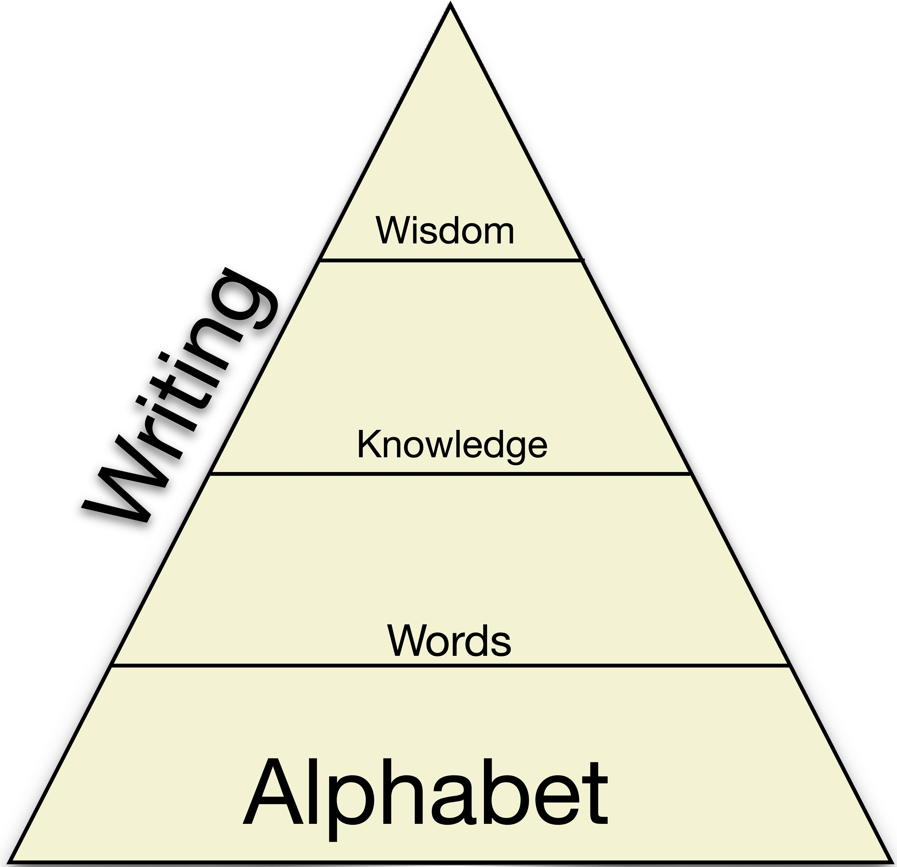
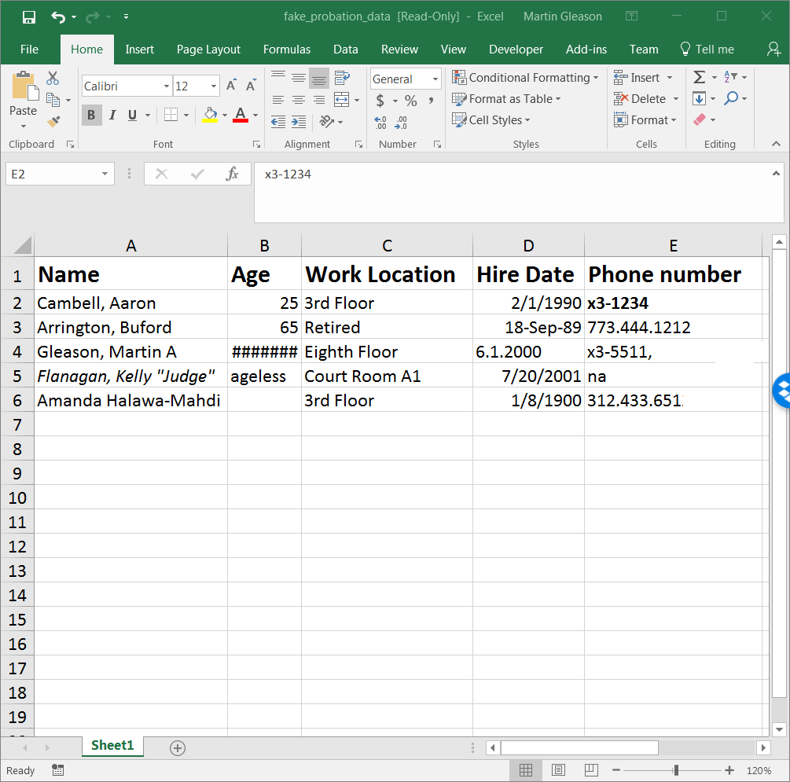

```{r, packages, include=T, echo=FALSE, message = FALSE, warning = FALSE}
library(tidyverse)
library(lubridate)
library(kableExtra)
library(viridis)
library(plotly)
library(xaringan)
source("normal_height.R")


# figure out how to make sure it works on windows or mac
# need to fix formating data
# need to fix git

```
class: title-slide
class: inverse
# Data Literacy for Court Staff 
## OR Data 101 for Court Staff


.center[*Sit back, relax. The training is about to begin!*]
.center[<iframe width="560" height="315" src="https://www.youtube.com/embed/lJJT00wqlOo" frameborder="0" allow="autoplay; encrypted-media" allowfullscreen></iframe>]
.bottom[.right[`r today() %>% format("%A, %B %m %Y")`]]

???
YouTube is for set up me, really.
# Materials needed for in-person training:
* paper for notes/exercises
* 5 + attendees copy of bad spreadsheet data

---
.center[#Learning Objectives:]

*  To become fluent with the language of data

*  To think critically about data

*  To become familiar with the fundamentals of OUR data
    + What we collect
    + How we collect it
    + Why we need it
*  What we can do to improve our Data Quality

*  To discover what you want to learn next
???
Icebreaker Exercise instructions: 
* Have everyone line up by birthday, descending, without speaking
* the point is to illustrate how critical language is to easy exchange of knowledge 
---
.center[# Expectations]
.center[]


.bottom[.center[What do **you** want to learn today?]]
---
class: center
# What Is Data? 
.center[]

.bottom[.center[What questions do you have about data?]]
---
class: center
# The Bro-Map

.pull-left[
]

.pull-right[.left[
Exercise 1: How do you use data?

{{content}}
]]

--

* Can be alone or in a group.
{{content}}

* Take the allotted time to note how you use personal **or** probation data.

???
* 10-15 minutes
* remind them to hold on to this
* materials required will include: Paper!
---
class: center
# Sharing is Caring
.center[]


.center[Who wants to share how they use data?]

???
* Ask staff to share how they use data
---
class: center
# Data or Information
  
.left[Data: 
* Facts, figures, and other abstract representations of the world
  + Height

  + Weight

  + Number of Charges

  + Length of Term of Probation

  + Demographics]
---
class: center
# Data or Information
.left[Information:
* Data that has been processed, given structure, and context
  + Charts and graphs

  + Risk Level

      - Credit

      - Census

  + Body Mass Index (BMI)

      - [Far From Perfect Model](https://www.npr.org/templates/story/story.php?storyId=106268439)]
---
# Data or Information

* Exercise: Revisit the *How do you use data.*

* Reclassify items as "Data or Information"

.center[]
---
# How much data do we need?
--


* Pros and cons of Personal Experience
--


* Professional/Clinical Judgment
--


  + *Challenging either can be easily interpreted as a personal attack*
--
 
  + *Why not just collect all the data?*
 
 
* **A better question is: What data do we need?**    


.center[]
???
* Point is to break down the difference between Data and Information
* Encourage the development of data driven culture
 
---
class: center
# The Language of Data
.pull-left[]
.pull-right[]
##Think of data and information as a new language that requires fluency
---
# Types of Data
## Quantitative

*  Discrete: only specific values matter for that data

*  Continuous: All values

*  *Examples?*

  + Height
--


  + Weight


--
  + Age


--


  + Income Data
--


  + Blood Pressure
---
# Types of Data

## Qualitative

*  Binary: Yes/No

*  Nominal: Names with no particular meaning

*  Ordinal: Scores or Ranks

*  Count/Ratio: Items per Area/Volume

*  *Examples?*
--

  + Tax Bracket

  + Probation Specific

     - Binary

     - Ordinal
    
  + Geographic Location
---
class: center
background-image: url(imgs/coffee.jpg)
background-size: cover;
#The Coffee Example

???
* coffee as discrete, continuous, and categorical(binary) data.
---
class:center
# Descriptive Statistics

>  "Descriptive statistics are brief descriptive coefficients that summarize a given data set, which can be either a representation of the entire or sample population. Descriptive statistics are broken down into measures of central tendency and measures of variability (spread)."

.right[[--Investopedia](https://www.investopedia.com/terms/d/descriptive_statistics.asp)]

---
# Measures of Central Tendency and Variablity


* Mean: Average
--


* Median: Equal point in the distribution
--


* Mode: Most frequent number
--


* Range: Minimum number to maximum number
--


* Variance: How spread out the data points are
--


* Standard Deviation: The distance, in the same unit, between data points

???
* Ask why these are useful measures for us
* point to JDAI stats, detention stats
* dis-aggregating data by race was a huge push for JDAI, what else should we separate?
---
class:center
# Total Height
```{r, TrickQuestion_one, include= TRUE, echo = F, fig.align='center', fig.height = 6, fig.width = 8, message = FALSE}
total_height_bar
```
---
class:center
## Density of Height
```{r, TrickQuestion_two, include= TRUE, fig.align='center', fig.height = 6, fig.width = 8, echo = F}
total_height
```
---
class:center
## Measures of Central Tendency with Height
```{r, trickquestionThree, include = TRUE, echo = FALSE, fig.align='center', fig.height = 6, fig.width = 8, message = FALSE}
bad_proof
```
---
## Chart Example
```{r, badchart, include = TRUE, echo = FALSE, warning = FALSE, fig.align='center', fig.height = 6, fig.width = 6, message = FALSE}
bad_height %>% kable() %>% kable_styling("striped", "bordered", full_width = TRUE)
```
---
## Exercise 2: How did I mislead you?
```{r, side_by_side, include = TRUE, warning = FALSE, out.width="49%", fig.height = 15, fig.width = 15, fig.show = "hold", message = FALSE, echo = FALSE}
total_height + theme(axis.text = element_text(family = "Nobile", size = 48 ),
        axis.title = element_text(family = "Nobile", size = 48 ))

total_height_bar + theme(axis.text = element_text(family = "Nobile", size = 48 ),
        axis.title = element_text(family = "Nobile", size = 48 ))
```

???
* Lead a discussion about what is wrong with this graph
* point out that it lacks
  + a title 
  + no sourcing information
  + units are not clear
  + Bar Graph is not normal
  + clue is in the chart
---
## Correct Way to Visualize
```{r, correct_viz, include = TRUE, echo = FALSE, message = FALSE, fig.align='center', fig.height = 4, fig.width = 10, message = FALSE}

total_height_sex_histogram +
    theme(panel.spacing = unit(5, "lines"))+
  facet_grid(~ sex)+
  theme(axis.text = element_text(family = "Nobile", size = 20 ),
        axis.title = element_text(family = "Nobile", size = 20 ),
        legend.text = element_text(family = "Nobile", size = 20),
        legend.title = element_text(family = "Nobile", size = 20))
total_height_chart %>% kable(caption = "All Measurements in cm") %>% 
  kable_styling("striped", "bordered", full_width = FALSE)

```
???
* ask if there are other questions or points to this graph
* point to the scales as another aspect to be critical of
---

# The Stastical Model

* A representation of what the data tells us

* The goal of:

  + Big Data

  + Machine Learning

  + AI
--

.center[]
???
Actuarial vs Statistical model discussion can occur.
---
# Four Kinds of Analytics

* Descriptive: What?
    + Very similar to descriptive statistics.

* Diagnostic: Why? 

* Predictive: What if?

* Prescriptive: Best course?
---
## Diagnostic Analytics

.center[]
* Why has the number of violations increased in this district?  
---
## Predictive Analytics
* What could happen

  + Chances of winning an election

  + Chances of developing an illness

  + Chance at re-offending
--


.center[]

  + What is the chance of this specific young person reoffending?
---
# Perscriptive  Analytics
* What is the best course of action?
.center[]

* What is the best service/intervention for this young person to reduce their level of risk?

---
## Exercise 3: Discussion of Prescriptive Statistics
--

.center[]
---
class: center, middle
# Word Cloud: Your Registration Data
```{r, wordcloud, include = T, message = FALSE, warning = FALSE, echo = FALSE, fig.align='center'}
source("wordcloud.R")


```
???
Wordcloud for discussion of metric and data
---
# How do we collect data or information?
--

* Personal Experiences

* TV

* Newspapers 

* Radio

* Conversations

* Comparison shopping

* Google

* Facebook
---
# How does the *Court* collect data?

* Forms
--


* Reports
--


* Studies
--


* JEMS

  + *C5/Supervisor is coming!*
--


* Other Systems
    + I-Clear
    + Clerks
    + State's Attorney
    + Schools
    + Hospital
    + Promise
--


* Databases
--


* *Spreadsheets*
---
.center[# Tidy Data]
* Each variable forms a column.
* Each observation forms a row.
* Each cell is atomic.
* Each type of observational unit forms a table.

--

.center[]
---
.center[# Spreadsheet Use]
* We use spreadsheets for:

  + Collection, cleaning, results, analysis

  + Provide structure to our data

  + Share data/information

  + Data Analysis

* In our office, we use Excel
  + Google Sheets

  + And, occasionally, tables in Word

  + What should we use Spreadsheets for?
---
class: center
# Exercise 4: Critique This Spreadsheet
.center[]
???
* This spreadsheet will be a handout
* Solo work
* 10-15 minutes
* The image will remain on screens
---
# Exercise 4: Takeaways

* Cells are not atomic

* Missing values

* Variable formats within entries
---
# Why Do We Need Data: Takeaways

* Evidence Based Practices

* Performance based budgeting

* Risk Level and Classification
---
# Four Kinds of Analytics: Redux

* Descriptive: What?

* Diagnostic: Why? 

* Predictive: What if?

* Prescriptive: Best course?

---
# Where Do We Go From Here
* We have the language, now what are *our* goals?
--


* With your table, discuss where you want to go from here.
--


* Use your SMART goals!
---
# Thank you
.center[]

* Please fill out your evaluation forms
* Email [martin.gleason@cookcountil.gov](mailto: martin.gleason@cookcountil.gov) if you have questions, comments, or vague misgivings


---
# Sources and Further Reading
* [Tidy data Paper](https://vita.had.co.nz/papers/tidy-data.pdf)
* [Data Literacy](https://www.gartner.com/webinar/3702517)
* [Algorithmic Sentencing](https://www.wired.com/2017/04/courts-using-ai-sentence-criminals-must-stop-now/)
* [Descriptive, predictive, prescriptive](https://halobi.com/blog/descriptive-predictive-and-prescriptive-analytics-explained/)
* [https://twitter.com/nlj/status/1004066012063559686](https://twitter.com/nlj/status/1004066012063559686)
* [4 kinds of analytics](https://www.kdnuggets.com/2017/07/4-types-data-analytics.html)
* [Super Important Outcome](https://blogs.uoregon.edu/rclub/2016/04/05/plotting-your-logistic-regression-models/)
* [Minitab: Flavors of Data](https://surfstat.anu.edu.au/surfstat-home/1-1-1.html)
* [Statistical Model](https://en.wikipedia.org/wiki/Statistical_model)
* [BMI](https://www.npr.org/templates/story/story.php?storyId=106268439)
* [Coffee Info Graphic](http://www.hammadakbar.com/marketing/content-creation-in-a-slump-here-are-5-ways-qualitative-data-can-help/)