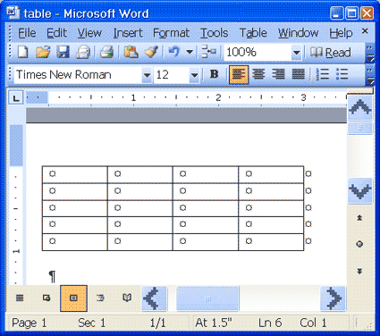

```{r, packages, include=T, echo=FALSE, message = FALSE, warning = FALSE}
library(tidyverse) 
library(lubridate)
library(kableExtra)
library(viridis)
library(plotly)
library(xaringan)
library("sysfonts")
library("showtext")
source("normal_height.R")


# figure out how to make sure it works on windows or mac
# need to fix formating data  ssh-add ~/.ssh/id_rsa
# need to fix gitv

```
class: title-slide
class: inverse, center
# Data Literacy for Court Staff
## Or Data 101: An E-Learning for Juvenile Probation Staff

 


---
.center[#Learning Objectives:]

*  To become fluent with the language of data

*  To think critically about data

*  To become familiar with the fundamentals of OUR data
    + What we collect
    + How we collect it
    + Why we need it
*  What we can do to improve our Data Quality

*  To discover what you want to learn next

---
class: center
# What Is Data? 
.center[]

.bottom[.center[What questions do you have about data and the court?]]
???
First item In quiz: Ask them what they wanted to learn.
---
class: center, middle
## The Bro-Map


.center[]

---
## The Bro-Map!

* Takes multiple kinds of data
  * GPS
  * Natural Language/Linguistic
  * Maps!
  
* Visualizes new information
  * What slang is is used where
  
   
* How could this be useful?
  * Marketers
  * Demographers/Researchers
     * Examining how concepts spread through the culture
---
# This is Data Science


.pull-left[]

.pull-right[
* Collect and store data

* Which is transformed into information

* Which fosters new insight

* Which lead to direct actions

* That (should) have better results
]

---
class: center
# Data or Information: What's the Difference?
  
.left[Data: 
* Facts, figures, and other abstract representations of the world
  + Height/Weight

  + Number of Charges

  + Length of Term of Probation

  + Demographics
  
* Data is a mathematical representation of the real world]
---
class: center
# Data or Information
.left[Information:
* Data that has been processed, structure, and context
  + Reports
 
  + Charts and graphs

  + Risk Level

      - Credit

      - Census

  + Body Mass Index (BMI)

      - [Far From Perfect Model](https://www.npr.org/templates/story/story.php?storyId=106268439)]
---
# Data Vs Experience

* **This is a false choice**
  * Personal Experience is personal data
  
  * Properly collected data represents multiple views
  
  * If personal experience varies from the data, it leads to great questions and avenues to explore
  
    + It does not mean the data is bad
  
---
# Data Vs Experience

* Ignore data and information at your peril

--
* Being critical of data collection and transformation is increasingly important in our society

  + Being critical is not the same as rejecting all data

* Your experiences are vital to the discussion. So is the data.

--

.center[]

---
# How much data do we need?

* Why not just collect all the data?
  * Security
  * Cost in processing
  * Storage cost is not typically an issue
    + But data privacy laws are
 
* **A better question is: What data do we need?**    

.center[]

---
class: center
# The Language of Data
.pull-left[]
.pull-right[]
</br>
</br>
---

# Types of Data
## Quantitative

*  Discrete: only specific values matter for that data

*  Continuous: All values

*  *Examples?*

--
  + Height
  
  
--
  + Weight


--
  + Age


--
  + Income Data
  
  
--
  + Blood Pressure
---
# Types of Data

## Qualitative

*  Binary: Yes/No

*  Nominal: Names with no particular meaning

*  Ordinal: Scores or Ranks

*  Count/Ratio: Items per Area/Volume

*  *Examples?*
--

  + Geographic Location/GPS
  
  + 2016 Election
  
  + Tax Bracket
---
# Types of Data
## Probation Specific Examples

* Quantitative Examples

--
  + Number of youth on probation
  
  + Number of Violations
    + By Officer
    
  + Number of service agencies

---
# Types of Data
## Probation Specific Examples

* Qualitative Examples

--
  + What services is the young person ordered to attend?
  
  + Violations of Probation 
  
      + Per district
      
      + Per Division
  
  + Termination Status

---
class: center, middle
#The Coffee Example
.center[]

???
* coffee as discrete, continuous, and categorical(binary) data.
---
# Morning Beverage Quiz

* What do you drink every morning?

* How much do you drink every morning
  
  + In discrete terms.
  + In continuous terms.
  
.center[]
---
class:center
# Descriptive Statistics

>  "Descriptive statistics are brief descriptive coefficients that summarize a given data set, which can be either a representation of the entire or sample population. Descriptive statistics are broken down into measures of central tendency and measures of variability (spread)."

.right[[--Investopedia](https://www.investopedia.com/terms/d/descriptive_statistics.asp)]

---
# Measures of Central Tendency and Variability


* Mean: Average
--


* Median: Equal point in the distribution
--


* Mode: Most frequent number
--


* Range: Minimum number to maximum number


???
* Ask why these are useful measures for us
* point to JDAI stats, detention stats
* dis-aggregating data by race was a huge push for JDAI, what else should we separate?
---

# Terms in Practice: [Shiny](https://shiny.rstudio.com) App

* Use this web app to [calculate](https://allcomicsconsideredstats.shinyapps.io/shiny_mean/) mean, median, mode and range.

## Instructions

* Enter whole numbers

* Separate numbers with white space

  * 44 56 
  
  * not 44, 56
  
The app will give you the measures of central tendency and a chart
---
## Best Practices: Visualization
```{r correct_viz, include = TRUE, echo = FALSE, message = FALSE, fig.align='center', fig.height = 5, fig.width = 10, message = FALSE}

total_height_sex_histogram +
    theme(panel.spacing = unit(5, "lines"))+
  facet_grid(~ Sex)+
  theme(axis.text = element_text(family = "Nobile", size = 20 ),
        axis.title = element_text(family = "Nobile", size = 20 ),
        legend.text = element_text(family = "Nobile", size = 20),
        legend.title = element_text(family = "Nobile", size = 20))

total_height_chart %>% kable(caption = "All Measurements in Inches") %>% 
  kable_styling("striped", "bordered", full_width = FALSE)

```
???
* ask if there are other questions or points to this graph
* point to the scales as another aspect to be critical of
* 
---
# The Statistical Model

* A mathematical representation of what ALL the data tells us

* Is a huge part of:

  + Big Data
  + Machine Learning
  + AI
  + Risk Assessments
      + Including: JRA, YASI, and JSOAP
.center[]
???

Actuarial vs Statistical model discussion can occur.

* Actuarial instruments attach specific statistical weighting to different variables which assess the risk.
* A key defining aspect of actuarial instruments is that scores obtained on individuals can be related to statistical reference data.
* ARAI are based on stats and stat modeling and work on predictive, where stat models work on work on classification, predictive, and prescriptive
[source](http://www.corinederuiter.eu/risk.php)
---
# Model Fitting
.center[]

---
# Four Kinds of Analytics

* Descriptive: What?
    + Very similar to descriptive statistics
--

* Diagnostic: Why?
    + Next step model creation
--

* Predictive: What if?
    + What many models are created for
--

* Prescriptive: Best course?
    + The end goal
---
## Diagnostic Analytics

.center[]

* Why did this happen?

* Why has the number of violations increased in this district?  

    + What kind of diagnostic questions should we ask?

---
## Predictive Analytics
* What could happen.

  +  Focus on the probabilities of *an event occuring*

* Chances of winning an election

* Chances of developing an illness

* Chance at re-offending
--


.center[]

  + What is the chance of this specific young person re offending?
---
# Prescriptive  Analytics
* What is the best course of action?
.center[]

* What is the best service/intervention for this young person to reduce their level of risk?

---
## Exercise 3: Discussion of Prescriptive Statistics
--

.center[]

* This is what all of our models are attempting to answer
---
# How do we collect data or information?
--

* Personal Experiences

* TV

* Newspapers 

* Radio

* Conversations

* Comparison shopping

* Google

* Facebook
---
# How does the *Court* collect data?

* Forms
--


* Reports
--


* Studies
--

* JEMS/C5/Supervisor

* Assessment Tools
--

* Other Systems
    + I-Clear
    + Clerks
    + Crimes (State's Attorneys)
    + Schools
    + Hospital
    + Promise
---
#How do we store Data

* Word Documents 

* Databases
--

* *Spreadsheets*
--


.center[]
---
# How We Store Data

* Tabular Data
  + Data in a table format

* Word Document/Text is for reporting, not storing raw data

* Does not do basic Spreadsheet Functions

.center[]

---
.center[# Spreadsheet Use]
* In our office we use
  + Excel (2003, 2007, 2013, 2016)

* We use spreadsheets for:

  + Collection, cleaning, results, analysis

  + Provide structure to our data

  + Share data/information

  + Data Analysis

---
# Tidy Data
* Each variable forms a column.

* Each observation forms a row.

* Each cell is "atomic."

* Each type of observational unit forms a table.

--

.center[]
---
class: center
# Quiz 2: Critique This Spreadsheet
.center[]

---
# Exercise 4: Takeaways

* Cells are not "atomic"

* Missing values

* Variable formats within entries
---
# Why Do We Need Data: Recap

* Evidence Based Practices

* Performance based budgeting

* Risk Level and Classification

--
# Data is a langauge that we need to become fluent in.
 


---
# Thank you
.center[]

* Check your email for your evaluation forms
* Email [martin.gleason@cookcountil.gov](mailto: martin.gleason@cookcountil.gov) if you have questions, comments, or vague misgivings


---

# Sources and Further Reading

* [DataCamp](https://datacamp.com)
* [Tidy data Paper](https://vita.had.co.nz/papers/tidy-data.pdf)
* [Data Literacy](https://www.gartner.com/webinar/3702517)
* [Algorithmic Sentencing](https://www.wired.com/2017/04/courts-using-ai-sentence-criminals-must-stop-now/)
* [Descriptive, predictive, prescriptive](https://halobi.com/blog/descriptive-predictive-and-prescriptive-analytics-explained/)
* [Google Maps as Presecriptive Data](https://twitter.com/nlj/status/1004066012063559686)
* [4 kinds of analytics](https://www.kdnuggets.com/2017/07/4-types-data-analytics.html)
* [Super Important Outcome](https://blogs.uoregon.edu/rclub/2016/04/05/plotting-your-logistic-regression-models/)
* [Minitab: Flavors of Data](https://surfstat.anu.edu.au/surfstat-home/1-1-1.html)
* [Statistical Model](https://en.wikipedia.org/wiki/Statistical_model)
* [BMI](https://www.npr.org/templates/story/story.php?storyId=106268439)
* [Coffee Info Graphic](http://www.hammadakbar.com/marketing/content-creation-in-a-slump-here-are-5-ways-qualitative-data-can-help/)
---
* [Commentary on Statistical Assessment of Violence Recidivism Risk ](https://www.tandfonline.com/doi/full/10.1080/2330443X.2015.1029338#aHR0cHM6Ly93d3cudGFuZGZvbmxpbmUuY29tL2RvaS9wZGYvMTAuMTA4MC8yMzMwNDQzWC4yMDE1LjEwMjkzMzg/bmVlZEFjY2Vzcz10cnVlQEBAMA==)
* [Wired: COURTS ARE USING AI TO SENTENCE CRIMINALS. THAT MUST STOP NOW]([https://www.wired.com/2017/04/courts-using-ai-sentence-criminals-must-stop-now/)
* [A Comparision of Risk Assessments](http://www.nccdglobal.org/sites/default/files/publication_pdf/nccd_fire_report.pdf)